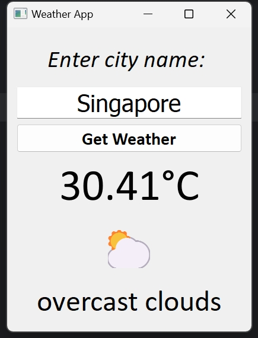

# 🌦️ PyQt5 Weather App

This is a **graphical weather application** built with **Python** and **PyQt5**, using the [OpenWeatherMap API](https://openweathermap.org/api).  
The app was created by following [Bro Code's YouTube tutorial](https://youtu.be/ix9cRaBkVe0?si=h4ChzDHjxLvNRnSz), with personalized styling and enhancements.

---

## 🎯 Project Purpose

The goal of this project was to:

- Practice **Python GUI programming** using **PyQt5**
- Learn how to **make HTTP requests** and process **JSON APIs**
- Understand layout management and custom styling in PyQt5
- Create a fun and practical **real-world application**

---
## Screenshot

---
## 🛠️ Requirements

- Python 3.x
- PyQt5
- requests
